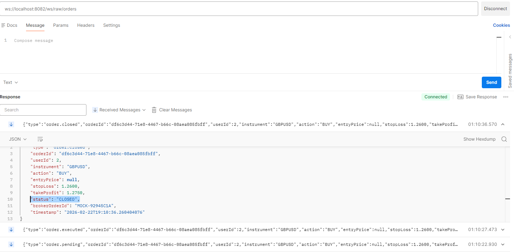

# Trading System

A modular-monolith based trading system where user can send a message 
to the broker and an order will automatically take place.

# Architecture

Pub-Sub architecture followed to make the each service de-coupled. Kafka
used as a broker which can process message asynchronously.

Full process divided into 3 modules such as-
1. Signal Ingestion Service (produce message through Webhook to 
 kafka topic `trading.signals.raw`)
2. Trade Execution Service (consume raw message from topic
`trading.signals.raw`, check message structure, create order, 
produce the order to another kafka topic `trading.orders.updates`
and mock the full order process)
3. Notification Service (consume the order from the kafka topic and
`trading.orders.updates` broadcast orders to the predefined websocket channel for real-time
updates)

Note: No authentication and authorization has implemented. "userId" 
passed through the request body and query params for messages and 
broker account linking process.

# Tech Stack
1. Java 21
2. Spring Boot 3.5.11
3. PostgreSQL
4. Kafka
5. Docker

# Run Project
1. clone the repo:
```bash
    git clone https://github.com/MdTanvirHossainTusher/trading-system.git
    cd trading-system
```
2. steup .env file:
```bash
    cp .env.example .env
```
then,
```bash
    POSTGRES_USER=your_username
    POSTGRES_PASSWORD=your_password
    POSTGRES_DB=you_database
```
3. build project:
```bash
    docker compose up --build
```
4. verify running services:
```bash
    docker ps
```
5. create users:
```bash
    INSERT INTO users (username, email, password, role, created_at)
VALUES 
('user1', 'user1@gmail.com', '$2a$10$90LMgzt9T3Wk5OehRVXQ2.6YgQ6/2r4tQp4DFHX/wcyFteO4lA6oG', 'USER', CURRENT_TIMESTAMP),
('user2', 'user2@gmail.com', '$2a$10$90LMgzt9T3Wk5OehRVXQ2.6YgQ6/2r4tQp4DFHX/wcyFteO4lA6oG', 'USER', CURRENT_TIMESTAMP);
```
6. broker account:
```bash
    1. link and create broker account => POST http://localhost:8080/api/v1/accounts
    Request Body:
    {
        "userId": 1,
        "accountName": "My MT5 Account",
        "accountId": "MT5-123412",
        "apiKey": "my-secret-api-key-abr543",
        "brokerType": "METATRADER"
    }
    Response:
    {
        "status": "success",
        "message": "Broker account linked successfully",
        "statusCode": "201",
        "data": {
            "id": 5,
            "accountName": "My MT5 Account",
            "accountId": "MT5-123412",
            "apiKeyMasked": "****r543",
            "brokerType": "METATRADER",
            "active": true
        },
        "errors": null
    }
    
    2. get user accounts (if user have multiple account then latest account will be active
    and previous account become deactive) => GET http://localhost:8080/api/v1/accounts?userId={id}
    Request Body: None
    Response: 
    {
        "status": "success",
        "message": "Operation successful",
        "statusCode": "200",
        "data": [
            {
                "id": 5,
                "accountName": "My MT5 Account",
                "accountId": "MT5-123412",
                "apiKeyMasked": "****r543",
                "brokerType": "METATRADER",
                "active": true
            },
            {
                "id": 4,
                "accountName": "My MT5 Account",
                "accountId": "MT5-123411",
                "apiKeyMasked": "****r543",
                "brokerType": "METATRADER",
                "active": false
            }
        ],
        "errors": null
    }
```
7. send message to webhook:
```bash
    POST http://localhost:8080/api/v1/webhook/receive-signal
    
    1. Send BUY Signal (with price):
    
    Request Body:
    {
        "message": "BUY EURUSD @1.0860\nSL 1.0850\nTP 1.0890",
        "userId": 1
    }
    Response:
    {
        "status": "success",
        "message": "Signal queued for processing",
        "statusCode": "200",
        "data": {
            "signalId": "0f113119-9244-4959-838e-c21bc5a50c2c",
            "status": "QUEUED",
            "message": "Signal received and queued for processing"
        },
        "errors": null
    }
    
    ==> this is immediately return 200 OK and produce the message 
    to the kafka topic `trading.signals.raw`
    
    2. Send BUY Signal (market order):
    
    Request Body:
    {
        "message": "BUY GBPUSD\nSL 1.2600\nTP 1.2750",
        "userId": 2
    }
    
    3. Send SELL Signal:
    
    Request Body:
    {
        "message": "SELL USDJPY\nSL 150.50\nTP 149.00",
        "userId": 2
    }
    
    4. Send INVALID Signal (SL > TP on BUY - fail):
    
    Request Body:
    {
        "message": "BUY EURUSD\nSL 1.0900\nTP 1.0850",
        "userId": 1
    }
```
8. orders api:
```bash
    1. GET http://localhost:8081/api/v1/orders?userId={id}&page={pageNum}&size={pageSize}
    Request Body: None
    Response:
    {
        "status": "success",
        "message": "Orders retrieved successfully",
        "statusCode": "200",
        "data": {
            "content": [
                {
                    "id": "0e997951-8668-4417-afd9-51f3c7ebda65",
                    "userId": 1,
                    "instrument": "USDJPY",
                    "action": "SELL",
                    "entryPrice": null,
                    "stopLoss": 150.500000,
                    "takeProfit": 149.000000,
                    "status": "CLOSED",
                    "brokerOrderId": "MOCK-C6E32BF7",
                    "closedPrice": 150.500000,
                    "pnl": -7500.000000,
                    "createdAt": "2026-02-22T21:04:14.157117",
                    "updatedAt": "2026-02-22T21:04:29.182664"
                },
                {
                    "id": "2950683e-da3e-4318-a39f-3a64030c7113",
                    "userId": 1,
                    "instrument": "GBPUSD",
                    "action": "BUY",
                    "entryPrice": null,
                    "stopLoss": 1.260000,
                    "takeProfit": 1.275000,
                    "status": "CLOSED",
                    "brokerOrderId": "MOCK-178EC432",
                    "closedPrice": 1.260000,
                    "pnl": -75.000000,
                    "createdAt": "2026-02-22T21:03:59.106900",
                    "updatedAt": "2026-02-22T21:04:14.135096"
                },
                {
                    "id": "02ea9f0d-848a-4d79-b158-3f9fd5a25262",
                    "userId": 2,
                    "instrument": "EURUSD",
                    "action": "BUY",
                    "entryPrice": 1.086000,
                    "stopLoss": 1.085000,
                    "takeProfit": 1.089000,
                    "status": "CLOSED",
                    "brokerOrderId": "MOCK-6E7D3526",
                    "closedPrice": 1.085000,
                    "pnl": -10.000000,
                    "createdAt": "2026-02-22T21:03:44.076614",
                    "updatedAt": "2026-02-22T21:03:59.092467"
                }
            ],
            "pagination": {
                "currentPage": 0,
                "pageSize": 10,
                "totalElements": 3,
                "totalPages": 1,
                "first": true,
                "last": true,
                "hasNext": false,
                "hasPrevious": false
            }
        },
        "errors": null
    }
    
    2. get order by id: GET http://localhost:8081/api/v1/orders?userId={id}
    Response:
    {
        "status": "success",
        "message": "Orders retrieved successfully",
        "statusCode": "200",
        "data": {
            "content": [
                {
                    "id": "0e997951-8668-4417-afd9-51f3c7ebda65",
                    "userId": 1,
                    "instrument": "USDJPY",
                    "action": "SELL",
                    "entryPrice": null,
                    "stopLoss": 150.500000,
                    "takeProfit": 149.000000,
                    "status": "CLOSED",
                    "brokerOrderId": "MOCK-C6E32BF7",
                    "closedPrice": 150.500000,
                    "pnl": -7500.000000,
                    "createdAt": "2026-02-22T21:04:14.157117",
                    "updatedAt": "2026-02-22T21:04:29.182664"
                },
                {
                    "id": "2950683e-da3e-4318-a39f-3a64030c7113",
                    "userId": 1,
                    "instrument": "GBPUSD",
                    "action": "BUY",
                    "entryPrice": null,
                    "stopLoss": 1.260000,
                    "takeProfit": 1.275000,
                    "status": "CLOSED",
                    "brokerOrderId": "MOCK-178EC432",
                    "closedPrice": 1.260000,
                    "pnl": -75.000000,
                    "createdAt": "2026-02-22T21:03:59.106900",
                    "updatedAt": "2026-02-22T21:04:14.135096"
                }
            ],
            "pagination": {
                "currentPage": 0,
                "pageSize": 10,
                "totalElements": 2,
                "totalPages": 1,
                "first": true,
                "last": true,
                "hasNext": false,
                "hasPrevious": false
            }
        },
        "errors": null
    }
```
9. broadcast real-time order using websocket:
```bash
    subscribe to this channel: ws://localhost:8082/ws/raw/orders
```
10. analytics api:
```bash
    GET http://localhost:8081/api/v1/stats?userId={id}
    Response:
    {
        "status": "success",
        "message": "Operation successful",
        "statusCode": "200",
        "data": {
            "totalOrders": 3,
            "pendingOrders": 0,
            "executedOrders": 0,
            "closedOrders": 3,
            "failedOrders": 0,
            "totalPnl": -7585.000000,
            "winRate": 0.0,
            "winningTrades": 0,
            "losingTrades": 3
        },
        "errors": null
    }
```
11. check signal ingestion service health:
```bash
    GET http://localhost:8080/api/v1/health
    Response:
    {
        "status": "success",
        "message": "Operation successful",
        "statusCode": "200",
        "data": {
            "status": "UP",
            "service": "signal-ingestion-service"
        },
        "errors": null
    }
```
Note: Postman API collection is added to the repo as `Trading Signal System.postman_collection.json`

# Real time orders:


